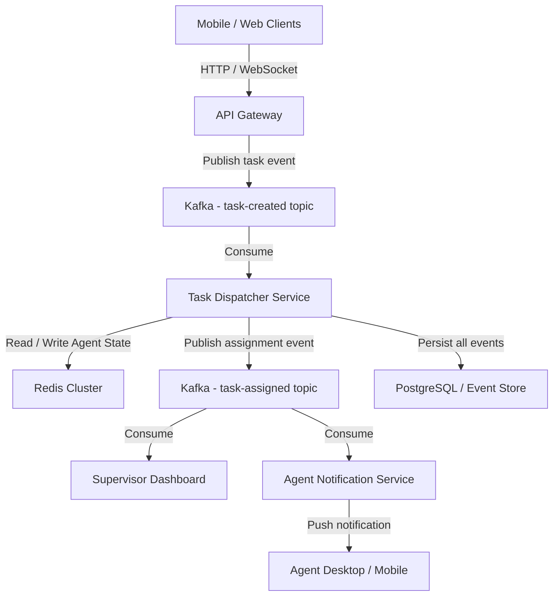
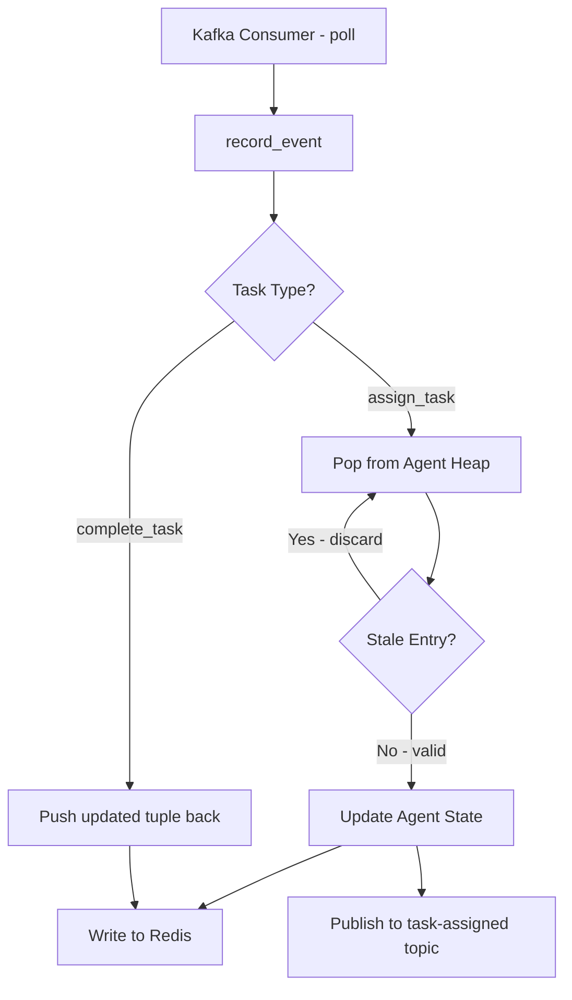
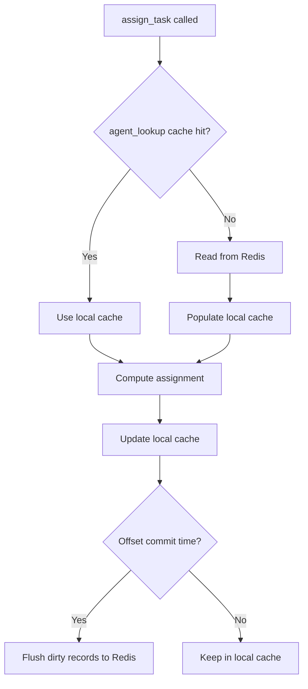
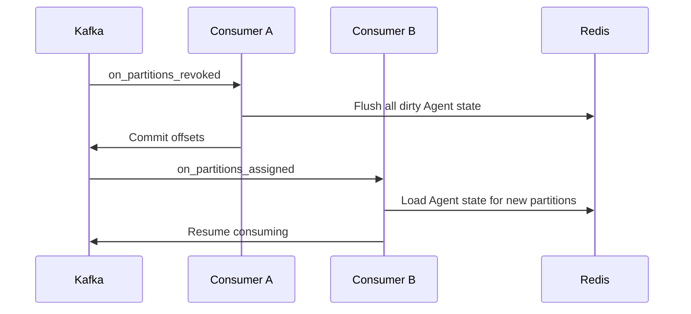
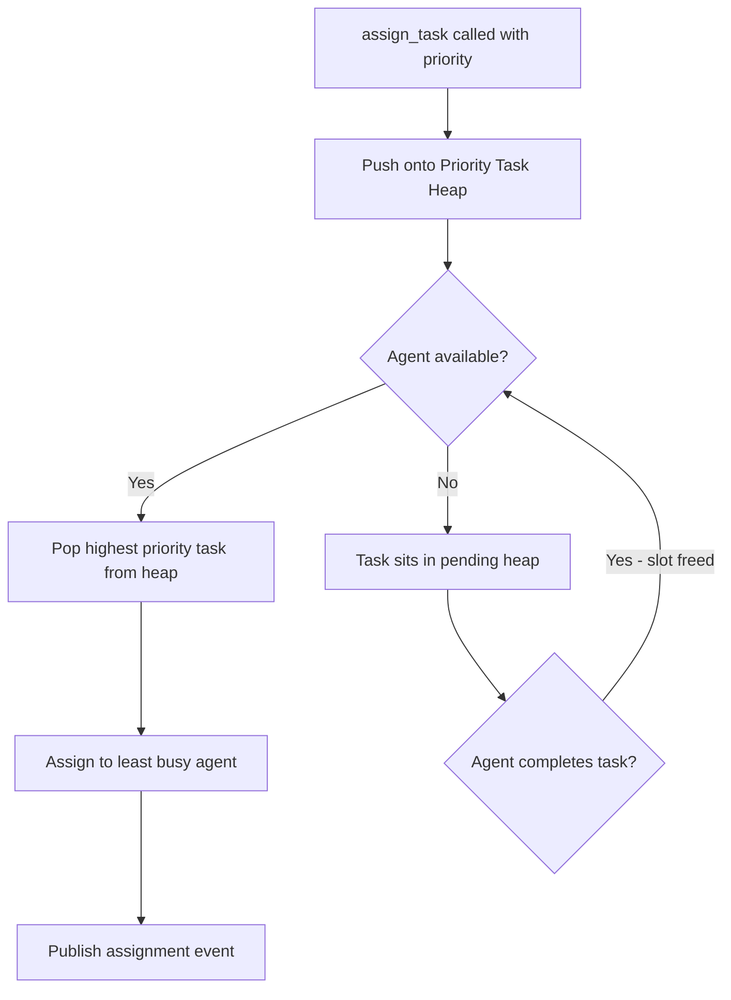
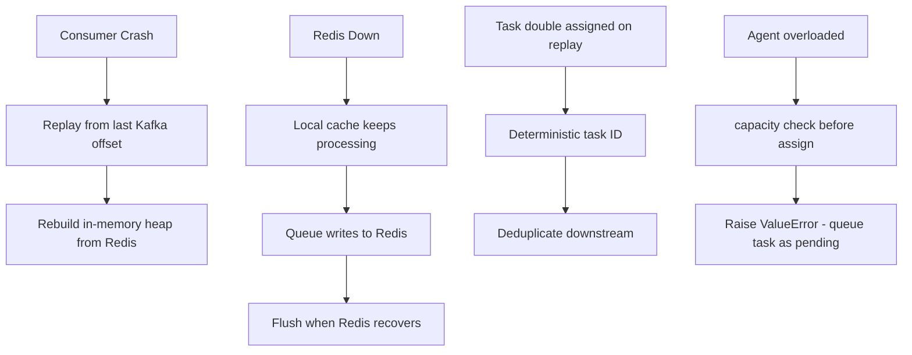
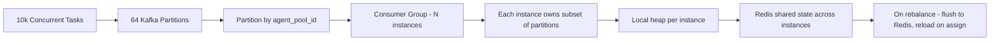

# Task Dispatcher — System Design

## 1. High Level Architecture

---

## 2. Task Dispatcher Service Internals

---

## 3. Agent State — Read / Write Path

---

## 4. Partition Rebalance Handling

---

## 5. Priority Task Extension

---

## 6. Failure Modes

---

## 7. Scaling

